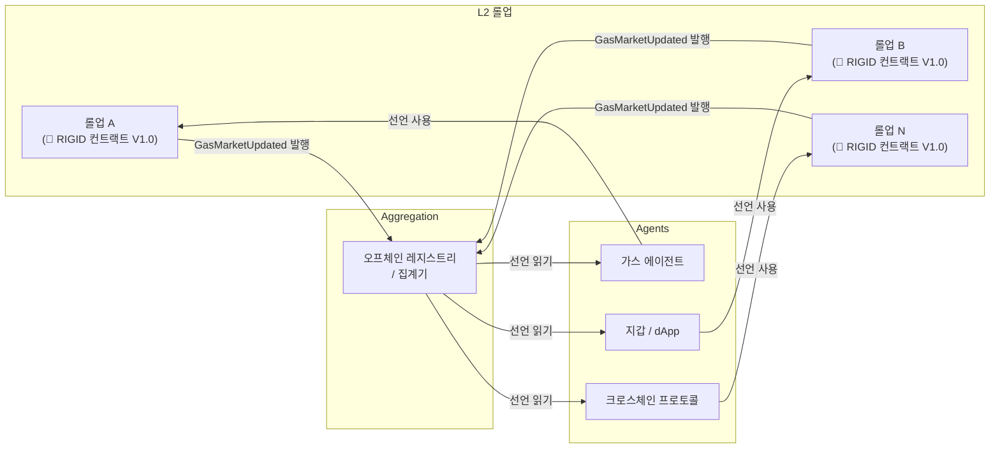
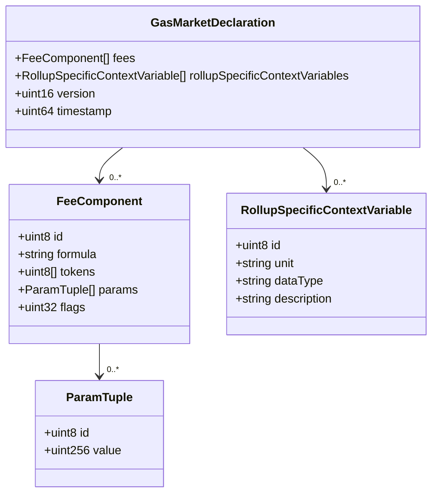
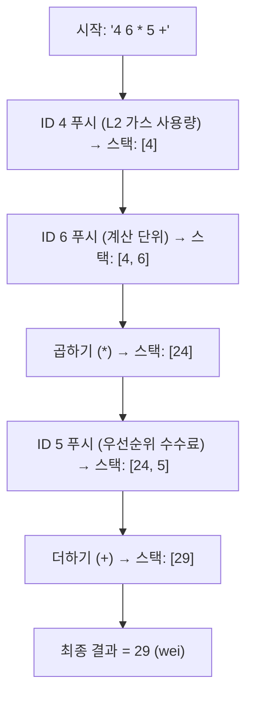
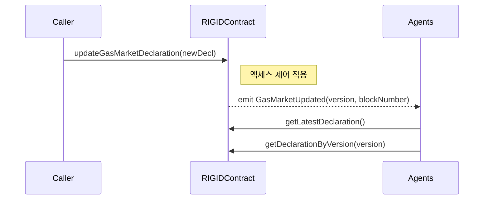
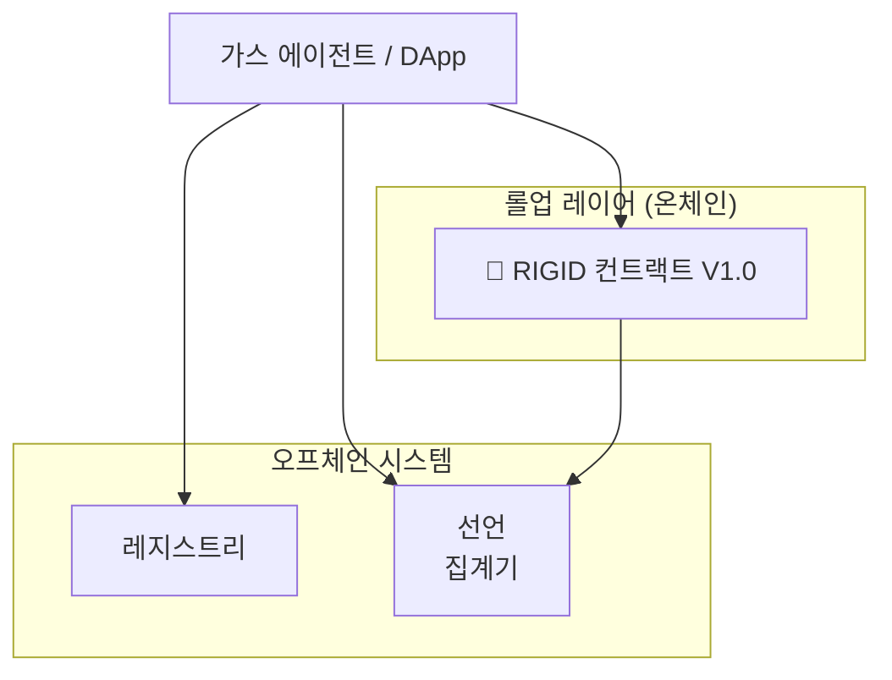

### 감사의 말

*이 사양 개발에 귀중한 의견을 주신 Łukasz Miłkowski에게 특별히 감사드립니다*

---

## 1. 서론

### 개요

RIGID(롤업 상호운용 가스 인터페이스 선언)는 이더리움 생태계의 롤업이 머신이 처리 가능한 형식으로 가스 마켓 특성을 선언하는 표준을 설정합니다. 이러한 매개변수를 게시함으로써, RIGID는 신뢰 없는 상호운용성, 가스 에이전트에 의한 자동화된 수수료 최적화, 그리고 다양한 레이어 2 솔루션 전반에 걸친 수수료 모델 변경에 대한 투명한 적응을 가능하게 합니다.

### 동기

오늘날 롤업은 서로 다르고 불투명한 가스 가격 모델로 운영되어 개발자, 사용자 및 자동화 에이전트가 생태계 전반의 트랜잭션 비용을 추론하기 어렵게 만듭니다. 이러한 복잡성은 각 롤업이 자체 수수료 구성 요소, 조정 로직 및 업데이트 주기를 정의하기 때문에 발생합니다 - 종종 오프체인에서 일관되지 않게 문서화됩니다.

RIGID는 롤업 가스 마켓에 대한 표준화된 온체인 선언 형식을 설정하여 이 격차를 해결합니다. 동기는 세 가지입니다:

* **투명성**: 가스 가격의 진실의 원천을 불투명한 오프체인 소스에서 검증 가능한 온체인 선언으로 전환하여 모호함을 최소화하고 일관된 해석을 가능하게 합니다.
* **머신 해석 가능성**: 구조화된 최소 스키마와 RPN 인코딩 공식을 활용하여 스마트 컨트랙트, 봇 및 인프라 제공자가 커스텀 통합 없이 가스 마켓 로직을 직접 파싱, 평가 및 응답할 수 있습니다.
* **상호운용성 및 집계**: 레지스트리 및 히스토리 액세스 메커니즘으로 뒷받침되는 일관된 인터페이스를 사용하여 멀티롤업 플랫폼과 에이전트가 롤업을 발견, 비교 및 라우팅할 수 있습니다.

네트워크가 가스 마켓 데이터를 노출하는 방식을 표준화함으로써, RIGID는 L2 생태계를 위한 새로운 구성 가능성과 조정 계층을 해제합니다.

#### *RIGID 생태계 개요 다이어그램*



---

## 2. RIGID 사양


각 네트워크에는 고유한 가스 마켓 모델이 있습니다. RIGID는 이 정보를 검증 가능한 방식으로 온체인에 게시하는 프로세스를 표준화합니다. RIGID는 구조화된 수수료 구성 요소와 강력한 RPN 형식주의와 같은 표준화된 필드 세트를 도입합니다. 이를 통해 자동화 시스템이 선언된 가스 마켓 매개변수를 검색하고, 수수료를 동적으로 계산하며, 변경에 즉시 반응할 수 있습니다. 이를 통해 롤업 가스 마켓 매개변수의 변경이 이벤트를 통해 투명하게 게시되고 브로드캐스트되어 실시간 자동 조정이 가능합니다.

예를 들어, Optimism의 `Ecotone`과 같은 역사적 프로토콜 업그레이드는 RIGID 선언에 의해 정의된 새 매개변수와 함께 `GasMarketUpdated` 이벤트를 트리거했을 것입니다. 롤업은 콜데이터 전용 수수료 모델에서 블롭 가격을 통합한 하이브리드 모델로 효과적으로 전환했습니다 - `baseFee`만 기반한 공식에서 이더리움의 블롭 데이터 가격(EIP-4844)을 반영하기 위해 `baseFeeScalar`와 `blobBaseFeeScalar` 모두로 가중된 공식으로 이동했습니다. 해당 RIGID 인터페이스는 이러한 매개변수 변경을 가스 에이전트에 명확하게 노출하여 자동화된 수수료 조정을 할 수 있습니다.


### 2.1 온체인 데이터 구조

RIGID는 롤업 가스 마켓 특성을 선언하기 위한 고도로 최적화된 **온체인 데이터 구조**(Solidity 구조체)를 정의하여 표준을 설정합니다. 이러한 구조화된 유형은 RIGID 선언의 정규 및 유일한 표현이며, 스마트 컨트랙트와 가스 에이전트의 온체인 저장소와 머신 처리 가능 파싱에서 최대 효율성을 위해 설계되었습니다.

핵심 선언은 `GasMarketDeclaration` 구조체 내에 캡슐화됩니다. 직접 포함된 모든 필드는 자동화된 의사 결정에 영향을 미칩니다. `GasMarketDeclaration`, `FeeComponent`, `ParamTuple` 및 `RollupSpecificContextVariable`을 포함한 모든 RIGID 구조체의 정확한 정의는 **섹션 5.1: 스마트 컨트랙트 인터페이스**에 제공됩니다.

#### *`GasMarketDeclaration` 온체인 데이터 구조 다이어그램 V1.0*




### 2.2 표준 컨텍스트 변수

**표준 컨텍스트 변수**는 RIGID 공식 내에서 수수료를 계산하는 데 필요한 사전 정의된 입력입니다. 각 변수는 고유한 `id`(`uint8`)로 식별됩니다. `0`에서 `100`까지의 ID는 이러한 전역적으로 정의된 표준 변수용으로 예약되어 있습니다.

이러한 변수는 온체인 수수료 공식에 의해 소비되며 수수료 공식에서 일반적으로 사용되는 매개변수를 나타냅니다. 그들의 유형과 단위는 스마트 컨트랙트와 가스 에이전트에 의한 결정적 해석을 보장하기 위해 정확하게 정의됩니다.

| ID | 변수 | 단위 | 유형 |
| :--- | :---------------------------------- | :----------- | :------ |
| 0 | L1\_basefee | wei/L1 가스 | uint256 |
| 1 | L1\_blob\_basefee | wei/블롭 가스 | uint256 |
| 2 | transaction\_calldata\_size\_bytes | 바이트 | uint256 |
| 3 | transaction\_blob\_count | 개수 | uint256 |
| 4 | transaction\_L2\_gas\_used | L2 가스 단위 | uint256 |
| 5 | user\_priority\_fee\_per\_gas | wei/L2 가스 | uint256 |
| 6 | transaction\_L2\_computation\_unit | 커스텀 단위 | uint256 |
| 7 | transaction\_proof\_size\_bytes | 바이트 | uint256 |
| 8 | transaction\_dac\_data\_size\_bytes | 바이트 | uint256 |
| 9 | L2\_state\_access\_reads | 개수 | uint256 |
| 10 | L2\_state\_access\_writes | 개수 | uint256 |
| 11 | calldata\_byte\_cost | L1 가스/바이트 | uint256 |
| 12 | max\_block\_size | 가스 단위 | uint64 |
| 13 | target\_block\_size | 가스 단위 | uint64 |
| 14 - 99 | `reserved_for_future_use` | - | - |

**컨텍스트 변수 접근성:** 표준 컨텍스트 변수 ID(0–99)에서 그들의 단위와 유형으로의 매핑은 정규 레지스트리(예: RIGID GitHub 저장소 내 또는 인덱서에 의해)에서 오프체인으로 유지됩니다. 구현자는 변수 메타데이터를 일관되게 해결하기 위해 이 레지스트리를 사용해야 합니다. 그들의 값은 직접 트랜잭션 입력 또는 레이어 1 또는 레이어 2 블록체인에서의 동적 상태 쿼리와 같은 다양한 소스에서 파생됩니다. RIGID 인터페이스를 사용하는 에이전트는 정확한 공식 평가를 위해 이러한 값을 그들의 컨텍스트에 통합할 것입니다.


**가스 단위에 대한 참고사항(EVM 생태계에서):** 모든 가스 비용은 궁극적으로 기본 통화 단위인 `wei`로 가치가 매겨지고 지불됩니다. 이것은 수수료 계산을 해석하는 데 중요합니다. `L2 가스 단위` 메트릭은 특정 레이어 2 롤업 내의 계산 작업을 정량화합니다. 사용자 수수료는 궁극적으로 `wei`로 지불되지만, `L2 가스 단위`와 `wei`의 해당 값 사이의 변환율은 각 롤업에 의해 정의되며 `wei/L1 가스` 비용과 다를 수 있습니다. `user_priority_fee_per_gas`는 `L2 가스 단위`당 지불할 의향이 있는 `wei` 양을 반영합니다. 반대로, `L1 basefee`와 `L1 blob basefee`는 롤업이 발생한 L1 비용을 나타내는 `wei/L1 가스`와 `wei/블롭 가스`로 표시됩니다. `calldata_byte_cost`는 콜데이터 바이트당 L1 가스 비용을 지정합니다. 이러한 구별을 통해 RIGID는 다양한 롤업의 미묘한 가스 경제학을 나타낼 수 있습니다.

### 2.3 롤업별 컨텍스트 변수

`rollup_specific_context_variables:RollupSpecificContextVariable[]`

롤업별 컨텍스트 변수는 특정 롤업의 가스 마켓에 고유한 동적 입력을 제공합니다. 이들은 롤업 자체에서 도입한 비표준 변수로, 고유한 수수료 모델에 특정하고 동적으로 변경되는 정보(예: 블록별, 롤업 상태 기반 또는 거버넌스 업데이트)를 나타냅니다. 롤업의 특정 수수료 `formula` 내에서 계산하는 데 필수적입니다.

각 롤업별 변수는 `RollupSpecificContextVariable` 구조체(섹션 5.1에 상세 설명) 내에서 정의됩니다. 이 구조체에는 다음이 포함됩니다:

* `id` (`uint8`): 커스텀 컨텍스트 변수의 고유 식별자
    * 롤업은 커스텀 컨텍스트 변수에 `100`에서 `199`까지의 ID를 사용해야 합니다(**MUST**). `0`에서 `99`까지의 ID는 표준 컨텍스트 변수와 표준 세트에 대한 잠재적 미래 추가용으로 예약되어 있습니다.
* `unit` (`string`): 변수의 단위
* `dataType` (`string`): 변수의 데이터 유형
* `description` (`string`): 변수의 목적에 대한 사람이 읽을 수 있는 설명

이러한 변수는 `GasMarketDeclaration` 구조체 내의 `rollupSpecificContextVariables` 배열에 포함되어 온체인 선언의 필수적인 부분이 됩니다.

### 2.4 수수료 배열

`GasMarketDeclaration` 구조체(섹션 5.1 참조) 내의 `fees` 필드는 **`FeeComponent` 구조체** 배열입니다. 각 `FeeComponent`는 가스 계산의 고유한 부분을 정의하며 다음 구조화된 필드를 포함합니다:

* `id:uint8`: 수수료 구성 요소의 숫자 식별자
* `formula:string`: 수수료 계산 로직을 정의하는 RPN(역폴란드 표기법) 문자열
* `tokens:uint8[]`: 허용되는 지불 토큰을 나타내는 숫자 토큰 ID 배열(예: ETH의 경우 `0`)
* `params:ParamTuple[]`: 공식에서 사용되는 상수 매개변수를 나타내는 `ParamTuple` 구조체(섹션 5.1에 정의) 배열
* `flags:uint32`: 수수료 구성 요소에 대한 특정 동작이나 수정자를 나타내는 비트 플래그

#### 2.4.1 ID 필드

`id:uint8`

`FeeComponent` 내의 `id` 필드는 `uint8` 숫자 식별자입니다.
이 ID는 수수료 구성 요소를 고유하게 식별하며 항상 컨텍스트 변수(표준 또는 롤업별)에 해당합니다.

* **표준 컨텍스트 변수:** RIGID 사양의 섹션 2.2에 정의됨
* **롤업별 컨텍스트 변수:** 섹션 2.3에 설명된 대로 `GasMarketDeclaration` 구조체의 `rollupSpecificContextVariables` 배열 내에서 필요시 정의됨

#### 2.4.2 RPN 공식 언어

`formula:string`

`formula` 필드에는 RPN(역폴란드 표기법)으로 인코딩된 문자열이 포함됩니다. RPN은 다음 특성으로 인해 온체인 평가와 자동화 에이전트의 처리에 적합하기 때문에 선택되었습니다:

* **효율적인 평가**: RPN은 스택 기반으로 제한된 환경 내에서 처리에 매우 효율적입니다.
* **결정적 로직**: 본질적으로 연산자 우선순위 모호성을 피하여 모든 구현에서 일관된 평가를 보장합니다.
* **컴팩트 인코딩**: RPN 문자열은 더 낮은 오버헤드로 파싱될 수 있어 효율적인 온체인 저장소와 머신 처리에 기여합니다.

**RIGID는 RPN을 활용하여 가스 에이전트가 수수료 공식을 안정적이고 효율적으로 처리할 수 있도록 합니다.**

RIGID 내에서 지원되는 연산자 세트는 모든 구현에서 일관된 평가를 보장하기 위해 구체적으로 정의됩니다. 인식되지 않는 연산자는 일관되게 0으로 기본 설정되거나 안전하게 되돌려야 하며, 무한 가스를 소비하거나 유효하지 않은 결과를 생성해서는 안 됩니다. 이 정책은 결정적이고 안전한 공식 평가를 보장합니다.
모든 연산은 **정수 나눗셈**(0을 향해 잘림)을 사용하는 **부호 없는 256비트 정수**에서 작동합니다.

**지원되는 연산자:**

* **산술:** `add (+)`, `multiply (*)`, `divide (/)`, `subtract (-)`
* **논리:** `greater than (>)`, `if (condition, true_result, false_result)`, `equal (=)`, `minimum (min)`, `maximum (max)`
* **수학 함수:** `square root (sqrt)`, `natural logarithm (ln)`

**수학 함수에 대한 오류 처리:**

구현은 결정적 결과를 보장하기 위해 잠재적 오류 조건을 우아하게 처리해야 합니다(**MUST**).
* **0으로 나누기**의 경우 결과는 `0`이어야 합니다(**MUST**).
* `sqrt`의 경우: 입력이 음수이면 결과는 `0`이어야 합니다(**MUST**).
* `ln`(자연 로그)의 경우:
    * 입력이 `0` 또는 `1`이면 결과는 `0`이어야 합니다(**MUST**).
    * 입력이 음수이면 결과는 `0`이어야 합니다(**MUST**).

**공식의 변수와 상수:**

`formula` 문자열에 나타나는 모든 숫자는 다음을 참조하는 **ID**입니다:

* **표준 컨텍스트 변수**: 섹션 2.2에 나열된 전역적으로 정의된 변수
* **롤업별 컨텍스트 변수**: `rollupSpecificContextVariables` 배열(섹션 2.3)에서 롤업에 의해 정의된 커스텀 변수
* **매개변수(`ParamTuple`)**: 공식 내에 필요한 모든 상수 값은 해당 특정 `FeeComponent`의 `params:ParamTuple[]` 배열 내에서 매개변수로 정의되어야 하며(**MUST**) 공식 문자열 내에서 ID(`200`에서 `255`)로 참조됩니다.

**공식의 단위 고려사항**: 구현자는 RPN 공식 로직이 관련된 컨텍스트 변수와 매개변수의 단위를 존중하도록 해야 합니다(**MUST**). 연산은 관련 단위(일반적으로 `wei`로 비용을 나타냄)의 최종 수수료 값을 생성하기 위해 수학적으로 의미 있는 방식으로 호환 가능한 단위만 결합해야 합니다.

**RPN 공식 예시:**

`formula` 필드에 `"4 6 * 5 +"` 문자열이 포함된 경우를 고려하세요.
이것은 다음 평가 로직에 해당합니다:

1.  ID `4`에 해당하는 값(`transaction_L2_gas_used`를 나타냄)을 푸시합니다.
2.  ID `6`에 해당하는 값(`transaction_L2_computation_unit`를 나타냄)을 푸시합니다.
3.  `*` (곱하기) 실행: 상위 두 값(6과 4)을 팝하고 곱한 후 결과(`4 * 6`)를 푸시합니다. 이것은 L2 실행 비용을 나타냅니다.
4.  ID `5`에 해당하는 값(`user_priority_fee_per_gas`를 나타냄)을 푸시합니다.
5.  `+` (더하기) 실행: 상위 두 값(5와 `4*6`)을 팝하고 더한 후 최종 결과 `(4 * 6) + 5`를 푸시합니다. 이것은 총 L2 실행 비용 + 우선순위 수수료를 나타냅니다.


#### *RPN 공식 평가 흐름 다이어그램*



### 2.4.3 토큰

**`tokens:uint8[]`**

이 배열은 이 특정 수수료 구성 요소의 지불에 허용되는 **토큰의 숫자 식별자**를 보유합니다(예: ETH의 경우 `0`). 각 `FeeComponent`는 관련 비용에 사용할 수 있는 토큰을 지정합니다. 이러한 숫자 토큰 ID에서 해당 토큰 컨트랙트 또는 심볼로의 매핑은 오프체인으로 유지되며, 일반적으로 컨텍스트 변수 메타데이터를 해결하는 것과 동일한 레지스트리에서 유지됩니다.
이 레지스트리는 정규 매핑을 제공하여 가스 에이전트가 허용되는 토큰을 이해하고 크로스체인 전송 또는 변환을 용이하게 하는 신뢰할 수 있는 컨텍스트에 액세스할 수 있도록 합니다.

| ID | 티커 | 헥스 (주소) |
| :--- | :----- | :------------------------------------------------- |
| 0 | ETH | `0x0000000000000000000000000000000000000000` |
| 1 | USDC | `0xA0b86991c6218b36c1d19D4a2e9Eb0cE3606eB48` |
| 2 | USDT | `0xdAC17F958D2Ee523a2206206994597C13D831ec7` |
| 3 | DAI | `0x6B175474E89094C44Da98b954EedeAC495271d0F` |
| 4 | MATIC | `0x7D1AfA7B718FbC363b0893A57080E1945F06Bd4b` |

### 2.4.4 매개변수 튜플 구조

**`params:ParamTuple[]`**

각 매개변수는 **`ParamTuple` 구조체**(섹션 5.1에 정의)로 정의됩니다. 이 구조체에는 `formula` 내에서 참조되는 `id`(`uint8`)와 해당 임의 정밀도 `value`(`uint256`)가 포함됩니다. 각 매개변수는 이 특정 수수료 구성 요소의 수수료 계산에 사용되는 상수를 나타내야 합니다(**MUST**).

컨텍스트 변수 ID와의 충돌을 피하기 위해 매개변수는 `200`에서 `255`까지의 ID를 사용해야 합니다(**MUST**) (`uint8`은 255까지).

### 2.4.5 플래그 사전

**`flags:uint32`**

`flags` 필드는 RPN `formula`에 정의된 계산을 넘어 **수수료 구성 요소**에 적용되는 특정 부울 동작이나 수정자를 나타내는 간결한 비트 메커니즘을 사용합니다. 이러한 플래그는 자동화 에이전트가 수수료를 처리하는 방식에 영향을 미치는 규칙을 신호합니다. 비트는 **빅엔디안** 순서로 해석됩니다.

| 비트 위치 | 플래그 이름 | 기본 동작 (비트가 0인 경우) |
| :----------- | :-------------------- | :------------------------------------------------------------------------- |
| 31 | `is_subsidized` | 트랜잭션이 보조금을 받지 **않습니다**. |
| 30 | `enforce_min_price` | 기본 계산을 넘어 최소 가격이 강제되지 **않습니다**. |
| 29 | `allow_zero_gas_payment` | 트랜잭션은 일부 가스를 지불해야 합니다(제로 지불 **불허**). |
| 28 | `fixed_fee` | 수수료가 고정 금액이 **아닙니다**. |
| 27 - 0 | `reserved_for_future_use` | 동작이 정의되지 않으며 **0(비활성)으로 처리되어야 합니다(MUST)**. |

**플래그 해석:**

플래그는 해당 비트가 주어진 수수료 구성 요소의 `flags` 필드에서 `1`인 경우 **활성**으로 간주됩니다. 비트가 `0`이면 플래그의 `default` 동작이 적용됩니다. `1`로 설정된 플래그가 인식되지 않는 경우(표준의 일부가 아닌 경우) 무시되어야 합니다(**MUST**).

**`flags` 필드 사용 방법:**

`flags` 필드가 `134217728`로 설정된 `FeeComponent` 구조체를 고려하세요.
이 십진수 값은 이진수(32비트)로 `0b00001000000000000000000000000000`에 해당하며, 비트 27(오른쪽에서 0 인덱스)만 `1`로 설정됩니다. 이것은 `fixed_fee` 플래그가 활성임을 나타냅니다.

#### 플래그 - 예시

- **`is_subsidized` (비트 31)**
  일부 롤업이나 애플리케이션이 최종 사용자를 대신하여 전체 수수료를 부담합니다.
  - *Immutable X*는 NFT 민팅/거래에 대한 모든 L2 가스를 지불합니다.
  - `is_subsidized = 1`로 설정하면 사용자의 잔액이 인출되지 않습니다; 프로토콜이 비용을 부담합니다.

- **`allow_zero_gas_payment` (비트 29)**
  사용자가 별도의 스폰서/페이마스터에 의존하여 제로 팁으로 트랜잭션을 제출할 수 있게 합니다.
  - Polygon PoS(Biconomy 통해)에서 사용자는 "가스리스" UX를 위해 0 팁으로 트랜잭션을 보낼 수 있습니다; 페이마스터 컨트랙트가 가스를 지불합니다.
  - `allow_zero_gas_payment = 1`로 설정하면 에이전트가 제로 사용자 수수료로 유효한 트랜잭션을 생성할 수 있습니다.


### 2.5 버전

**`version:uint16`**

이 정수는 이 선언에 사용된 **RIGID 사양 스키마의 버전**을 나타냅니다. 이를 통해 에이전트가 올바른 버전의 규칙에 따라 데이터를 해석하여 호환성과 적절한 스키마 해석을 보장할 수 있습니다.

### 2.6 타임스탬프

**`timestamp:uint64`**

이 필드는 이 RIGID 선언이 마지막으로 업데이트되거나 활성화된 시점을 나타내는 **UNIX 타임스탬프(초 단위)**를 기록합니다. 이를 통해 에이전트가 데이터의 최신성을 추적하고 선언된 매개변수의 유효 기간에 대해 추론할 수 있습니다.

---

## 3. 거버넌스 모델

### 롤업 제어 선언

* **네이티브 선언 컨트랙트**: 각 롤업은 자체 RIGID 스마트 컨트랙트를 온체인에 배포합니다. 권한이 부여된 엔티티만(예: 다중 서명 지갑, DAO 투표를 통해) 매개변수를 업데이트할 수 있습니다.
* **탈중앙화 감독**: 선언에 대한 업데이트(예: 새 버전 또는 공식 변경)는 이해 관계자 또는 커뮤니티 승인 프로세스를 거쳐야 합니다(**MUST**). 모든 변경은 투명성과 감사 가능성을 위해 온체인에 기록됩니다.


### 버전 관리 및 히스토리 데이터

* RIGID는 여러 버전의 가스 메커니즘을 지원합니다. 이전 버전은 영원히 온체인에 존재하여 히스토리 분석을 지원합니다.
* 각 선언에는 유효성을 정의하기 위한 `version`과 `timestamp`가 포함됩니다.
* 컨트랙트는 블록 또는 시간별로 과거 버전 쿼리를 지원해야 합니다(**SHOULD**).
* 새 버전은 활성화 시간 또는 블록을 명확히 정의해야 합니다(**MUST**).
* 레지스트리 또는 집계기는 버전 전반의 모든 선언을 추적할 수 있습니다(**MAY**).
* 버전 간 전환은 표준의 규칙을 따라야 합니다(**MUST**).


---

## 4. 업데이트 메커니즘 및 변경 관리

롤업이 가스 마켓을 수정할 때 다음 프로세스를 따릅니다:

### 거버넌스 기반 업데이트

* 거버넌스 결정(예: DAO 투표 또는 다중 서명 승인)이 변경을 승인합니다.
* 그런 다음 온체인 RIGID 선언은 `updateGasMarketDeclaration()`에 대한 권한 있는 호출을 통해 업데이트됩니다.
* 변경에는 새 매개변수, 공식, 버전 범프, 타임스탬프 및 근거가 포함됩니다.

### 온체인 선언 업데이트

* `updateGasMarketDeclaration` 함수가 완전한 `GasMarketDeclaration` 구조체와 함께 호출됩니다.
* 컨트랙트는 무단 변경을 방지하기 위해 액세스 제어(예: 다중 서명, DAO 역할)를 적용해야 합니다(**MUST**).
* 성공 시 `GasMarketUpdated` 이벤트가 발생합니다.

### 레지스트리 및 집계기 동기화

* 오프체인 및 온체인 집계기는 `GasMarketUpdated`를 수신합니다.
* 버전 또는 타임스탬프를 사용하여 히스토리를 유지하면서 실시간으로 로컬 레코드를 업데이트합니다.

### 히스토리 쿼리 효율성

* 직접 조회를 위해 선언은 버전별 O(1) 액세스를 위한 `mapping(uint16 => Declaration)`에 저장됩니다.
* 버전을 열거하기 위해 구현자는 페이지네이션 뷰를 사용할 수 있습니다. 예:

```solidity
function getVersions(uint16 start, uint16 count) view returns (uint16[] memory);
```
* 이벤트에서 버전 번호를 발생시키면 오프체인 인덱서가 온체인 루프 없이 업데이트를 추적할 수 있습니다.

---

## 5. 온체인 배포를 위한 기술 사양

### 5.1 스마트 컨트랙트 인터페이스

이 섹션에서는 RIGID 준수 온체인 선언 컨트랙트를 위한 의사 코드 인터페이스를 설명합니다. 이 인터페이스는 블록체인에서 직접 롤업 가스 마켓 매개변수를 게시하고 액세스하기 위한 정규 데이터 구조와 함수를 정의합니다.


```solidity
// --- 데이터 구조 ---

/**
 * @notice RPN 공식 내에서 사용되는 상수 매개변수를 정의합니다.
 */
struct ParamTuple {
    uint8   id;         // 매개변수 ID (공식에서 참조됨, >= 200)
    uint256 value;      // 매개변수의 임의 정밀도 숫자 값
}

/**
 * @notice 전체 수수료 계산의 단일 구성 요소를 정의합니다.
 */
struct FeeComponent {
    uint8   id;         // 수수료 구성 요소 식별자 (컨텍스트 변수 ID에 해당)
    string  formula;    // 수수료 계산 로직을 정의하는 RPN 문자열
    uint8[] tokens;     // 허용되는 지불 토큰 ID 배열 (예: ETH의 경우 0)
    ParamTuple[] params; // 공식에서 사용되는 상수 매개변수 배열
    uint32  flags;      // 특정 동작을 위한 비트 플래그 (예: 보조금, 고정 수수료)
}

/**
 * @notice 특정 롤업에서 도입한 커스텀 컨텍스트 변수를 정의합니다. 숫자 수수료 구성 요소 ID와 토큰 ID는 오프체인 정규 레지스트리를 사용하여 해결되어야 합니다.
 * @dev 이러한 변수는 롤업에 고유한 가스 마켓 계산을 위한 동적 컨텍스트를 제공합니다.
 */


struct RollupSpecificContextVariable {
    uint8   id;          // 커스텀 컨텍스트 변수 ID (100-199)
    string  unit;        // 변수의 단위 (예: "L1 가스 단위")
    string  dataType;    // 변수의 데이터 유형 (예: "uint256)
    string  description; // 변수에 대한 사람이 읽을 수 있는 설명
}

/**
 * @notice 롤업의 가스 마켓에 대한 완전한 선언.
 * @dev 이 구조체는 자동화된 가스 비용 추정에 필요한 모든 매개변수를 캡슐화합니다.
 */
struct GasMarketDeclaration {
    RollupSpecificContextVariable[] rollupSpecificContextVariables; // 커스텀 컨텍스트 변수 배열
    FeeComponent[]                  fees;                           // 수수료 구성 요소 배열
    uint16                          version;                        // RIGID 사양 스키마 버전
    uint64                          timestamp;                      // 이 선언이 마지막으로 업데이트된 UNIX 에포크 초

    // 고려사항: 표준 컨텍스트 변수(섹션 2.2에 정의)는 일반적으로 트랜잭션의 수수료 계산에 대한 직접 입력(예: 콜데이터 크기)이거나
    // L1 또는 L2 블록체인 상태에서 쿼리되는 동적 값(예: L1 기본 수수료, L2 블록 제한)을 나타냅니다.
    // 따라서 이러한 변수는 이 핵심 `GasMarketDeclaration` 구조체 내에 필드로 명시적으로 포함되지 않습니다.
    // 그러나 RPN `formula` 문자열을 평가하는 데 필수적인 입력이며, 정의된 ID로 참조됩니다.
}

// --- 이벤트 ---

/**
 * @notice 가스 마켓 선언이 온체인에서 업데이트될 때 발생합니다.
 * @dev 이 이벤트는 오프체인 소비자에게 최신 선언을 제공합니다.
 * @param currentDeclaration 현재 활성화된 전체 GasMarketDeclaration 구조체.
 * @param blockNumber 업데이트가 발생한 블록 번호.
 */
event GasMarketUpdated(
    GasMarketDeclaration currentDeclaration,
    uint256 blockNumber
);

// --- 컨트랙트 인터페이스 ---

/**
 * @notice 가장 최근 활성화된 가스 마켓 선언을 조회합니다.
 * @return 현재 상태를 나타내는 GasMarketDeclaration 구조체.
 */
function getLatestDeclaration() view returns (GasMarketDeclaration) {
    // 가장 최근 활성화된 선언을 반환합니다.
    // 구현에는 상태 변수 읽기가 포함됩니다.
}

/**
 * @notice 가스 마켓 선언의 특정 히스토리 버전을 조회합니다.
 * @param _version 조회할 특정 버전 번호.
 * @return 요청된 버전의 GasMarketDeclaration 구조체.
 */
function getDeclarationByVersion(uint16 _version) view returns (GasMarketDeclaration) {
    // 버전 번호로 선언을 조회하는 로직.
    // 일반적으로 히스토리 로그 또는 매핑을 반복하는 것을 포함합니다.
}

/**
 * @notice 온체인 가스 마켓 선언을 새 버전으로 업데이트합니다.
 * @dev 이 함수는 강력한 거버넌스 메커니즘(예: 다중 서명, DAO)에 의해 보호되어야 합니다.
 * 성공적인 선언 시 `GasMarketUpdated` 이벤트를 발생시킵니다.
 * @param _newDecl 현재 활성화된 선언으로 설정할 새 GasMarketDeclaration 구조체.
 */
function updateGasMarketDeclaration(GasMarketDeclaration _newDecl) external {
    // 개념적 액세스 제어: require(_msgSender() has governance role);
    // GasMarketDeclaration oldDecl = getLatestDeclaration(); // 온체인 로직에 이전 상태가 필요한 경우.

    // 'currentDeclaration'이 활성화된 선언을 보유하는 상태 변수라고 가정합니다.
    // currentDeclaration = _newDecl;

    // emit GasMarketUpdated( /* oldDecl, */ _newDecl, block.number);
}
```




### 5.2 예시 선언

```solidity
GasMarketDeclaration example = GasMarketDeclaration({
  version: 1,
  timestamp: 1717000000,
  rollupSpecificContextVariables: new RollupSpecificContextVariable ,
  fees: new FeeComponent
});

// 하나의 롤업별 컨텍스트 변수 정의
example.rollupSpecificContextVariables[0] = RollupSpecificContextVariable({
  id: 100,
  unit: "bytes",
  dataType: "uint256",
  description: "zk_proof_size"
});

// 하나의 수수료 구성 요소 정의
ParamTuple ;
params[0] = ParamTuple({ id: 200, value: 1000 });

example.fees[0] = FeeComponent({
  id: 1,
  formula: "2 200 * 5 +", // calldata_size * 1000 + priority_fee
  tokens: new uint8 ,
  params: params,
  flags: 0
});

example.fees[0].tokens[0] = 0; // ETH
```

### 5.3 구현 고려사항


* 구현자의 경우 스마트 컨트랙트에서 가스 비용을 최적화하는 것은 종종 트레이드오프를 수반합니다. 전체 `GasMarketDeclaration` 구조체와 같은 대용량 데이터 구조를 이벤트에서 발생시키면 로그 저장소 비용으로 인해 상당한 가스 소비가 발생할 수 있습니다. 일반적인 패턴은 최소 데이터(예: `version`, `blockNumber` 또는 해시)만 발생시키고 오프체인 소비자가 `getLatestDeclaration()`을 통해 전체 구조체를 조회하도록 하는 것입니다.

* 마찬가지로 전체 `GasMarketDeclaration` 업데이트는 간단하지만, 더 가스 효율적인 대안은 개별 `FeeComponent` 또는 `RollupSpecificContextVariable` 항목에 대한 타겟팅된 업데이트를 지원하는 것을 포함할 수 있습니다. 이것은 선언이 자주 변경될 때 특히 유용합니다.

* 수수료 계산에서 단위 불일치를 방지하기 위해 구현자는 각 컨텍스트 변수 ID를 해당 단위에 매핑하는 최소한의 `UnitRegistry`를 정의해야 합니다. 업데이트는 단위 호환성을 검증하고 호환되지 않는 참조에서 되돌려야 합니다.

* 소비자는 오버플로우 또는 잘못된 수수료 결과를 피하기 위해 실행 전에 오프체인에서 공식을 검증하고 단위 호환성을 확인해야 합니다. RIGID의 향후 버전에는 더 엄격한 검증 규칙 또는 외부 검증 메커니즘이 포함될 수 있습니다.


## 6. 레지스트리, 집계 및 크로스체인 통신


### 6.1 오프체인 레지스트리 및 집계기


- 컨텍스트 변수 정보(id, 변수 이름, 유형, 단위), 토큰 메타데이터 및 RIGID 선언 소비자에게 유사하게 관련된 정보가 있는 레지스트리는 커뮤니티에서 오프체인으로 호스팅할 수 있습니다
- 제3자 또는 커뮤니티 집계기는 다양한 롤업의 개별 RIGID 컨트랙트를 쿼리하고 더 나은 에이전트 경험을 위해 체인 전반에 걸친 가스 마켓 속성의 집계된 뷰를 제공할 수 있습니다.


#### *RIGID 레이어 전반의 가스 에이전트 데이터 흐름*




### 6.2 크로스체인 데이터


- 집계기는 릴레이어 또는 오라클을 사용하여 RIGID 데이터를 다른 목적지에 온체인으로 가져올 수 있습니다.
- 메시징 프로토콜은 롤업이 중앙 레지스트리에 업데이트를 푸시하는 데 사용될 수 있습니다.
- 오프체인 시스템과 멀티체인 앱이 크로스체인 트랜잭션 라우팅, 집계된 L2 비용을 표시하는 탈중앙화 거래소 또는 크로스체인 블록 탐색기와 같은 목적으로 일관된 수수료 데이터를 소비할 수 있게 합니다.


## 7. 보안 고려사항

RIGID 사양은 가스 마켓 매개변수를 선언하기 위한 구조화된 온체인 형식을 도입합니다. 구현자는 다음 위험과 완화 방법을 고려해야 합니다:

- **거버넌스 제어**: 권한이 부여된 엔티티(예: 다중 서명 또는 DAO)만 선언을 업데이트할 수 있어야 합니다(**MUST**). 부적절한 액세스 제어는 수수료 추정 또는 라우팅 로직에 영향을 미치는 악의적이거나 잘못된 선언으로 이어질 수 있습니다.
- **단위 비호환성**: 공식에서 단위(예: wei와 바이트)를 잘못 혼합하면 잘못된 수수료 계산이 발생할 수 있습니다(**MAY**). 최소한의 `UnitRegistry`와 엄격한 검증 로직을 사용하여 유효하지 않은 업데이트를 감지하고 방지해야 합니다(**SHOULD**).
- **공식 평가 안전성**: RPN 평가는 0으로 나누기 또는 `ln()` 및 `sqrt()`에 대한 유효하지 않은 입력과 같은 유효하지 않은 연산을 안전하게 처리해야 합니다(**MUST**). 이것들은 throw가 아닌 0을 반환해야 합니다(**MUST**).
- **오프체인 에이전트 위험**: 소비자는 오프체인에서 입력을 검증해야 하며(**MUST**) 조작, 오버플로우 또는 예기치 않은 공식 동작을 방지하기 위해 제한과 안전 장치를 적용해야 합니다(**SHOULD**).
- **타임스탬프 신뢰**: 선언에는 `timestamp`가 포함되지만, 소비자는 추가 검증(예: 이벤트 블록 번호 확인) 없이 이를 최신성의 증거로 의존해서는 안 됩니다(**MUST NOT**).

이러한 고려사항은 잘못된 가스 계산, DoS 벡터 또는 잘못 구성된 선언을 통한 익스플로잇 경로를 피하는 데 필수적입니다.

## 8. 하위 호환성

이 사양은 새롭고 선택적인 표준을 도입합니다. 기존 롤업 또는 L1 프로토콜 동작을 수정하지 않습니다.

RIGID 선언은 격리된 온체인 컨트랙트에 존재하며 통합자가 채택하지 않는 한 레거시 가스 가격 시스템을 방해하지 않습니다.

롤업은 기존 문서화 노력과 병행하여 RIGID를 채택할 수 있습니다(**MAY**).

## 9. 결론


RIGID는 이더리움 롤업이 균일하고 머신이 처리 가능한 형식으로 가스 마켓 매개변수를 투명하게 게시할 수 있도록 하는 범용 온체인 표준을 설정합니다. 잘 정의된 컨텍스트 변수와 함께 구조화된 최소 스키마와 RPN 인코딩 수수료 공식을 활용하여 자동화 에이전트가 비용을 정확하게 추정하고, 진화하는 수수료 모델에 동적으로 적응하며, 다양한 레이어 2 환경 전반에 걸쳐 트랜잭션을 최적으로 라우팅할 수 있게 합니다.

내장된 버전 관리와 이벤트 기반 업데이트 메커니즘은 완전한 감사 가능성과 신뢰 없는 상호운용성을 보장하며, 온체인 레지스트리와 선택적 집계기는 통합된 뷰와 실시간 알림을 제공하여 더 나은 경험을 제공합니다. 총체적으로 RIGID는 개발자, 운영자 및 에이전트가 롤업 가스 마켓과 자신 있고 효율적으로 상호 작용할 수 있는 응집력 있고 확장 가능한 생태계를 위한 기술적 기반을 마련합니다.

## 10. 열린 질문 및 향후 고려사항

RIGID가 실용적이고 견고하며 구현 가능하도록 하기 위해 다음 영역은 추가 정의 또는 개선이 필요합니다:

* **정규 컨텍스트 변수 소스:**
    표준 컨텍스트 변수(ID 0–99)의 단위, 유형 및 레이블은 온체인에 저장할 필요가 없습니다. 정규 오프체인 레지스트리(예: RIGID GitHub 저장소 또는 탈중앙화 인덱서)에서 유지될 수 있습니다. 이를 통해 불필요한 온체인 상태를 피하고 커뮤니티 기여를 단순화합니다. 도구와 에이전트는 검증 및 표시 목적으로 이 레지스트리에서 직접 변수 메타데이터를 해결할 수 있습니다. 동일한 접근 방식이 `FeeComponent.tokens`의 토큰 레지스트리에 적용됩니다. 이를 통해 통합자가 정확히 동일한 메타데이터를 일관되게 해결하여 생태계 전반의 일관성을 유지할 수 있습니다. 이 정규 오프체인 레지스트리의 특정 거버넌스, 무결성 및 도구 정의는 열린 논의로 남아 있습니다.
* **이벤트 발생 모드:**
  전체 `GasMarketDeclaration` 구조체를 지속적으로 발생시키는 것은 비용이 많이 듭니다. 구현자는 컨트랙트가 가스 효율성을 위해 최소 데이터 `(version, hash, blockNumber)`만 브로드캐스트하고 전체 선언은 뷰 함수를 통해 오프체인에서 조회할 수 있도록 명시적 발생 모드(`Full` vs `Lite`)를 정의할 수 있습니다.
* **온체인 단위 검증:**
  호환되지 않는 단위(바이트, 가스 단위, wei)를 혼합하여 발생하는 조용한 계산 오류를 방지하기 위해 각 컨텍스트 변수 ID를 해당 단위에 명시적으로 매핑하는 최소한의 온체인 `UnitRegistry`를 도입할 수 있습니다. 구현자는 이 매핑을 활용하고 선언 업데이트 흐름에 검증 단계를 추가하여 호환되지 않는 단위 참조가 명확하고 즉시 되돌려지도록 할 수 있습니다.
* **공식 연산자 정책:**
  RPN 공식에서 지원되는 수학 연산자를 확장하기 위한 명확한 거버넌스 기반 정책을 수립합니다. 인식되지 않는 연산자는 명시적으로 되돌려야 하며, 조용한 실패나 의도치 않은 가스 소비를 방지합니다.
* **ID 네임스페이스 여유:**
  현재 `uint8` ID 네임스페이스에서 더 큰 `uint16` 네임스페이스로의 명확하지만 선택적인 마이그레이션 경로를 문서화할 수 있습니다. 즉각적인 마이그레이션은 필요하지 않지만, 계획된 업그레이드 경로를 지정하면 네임스페이스가 잠재적 고갈을 피하고 향후 확장을 편안하게 수용할 수 있습니다.
* **히스토리 조회 무결성:**
  각 선언에 암호화 앵커(예: 부모 블록 해시 또는 머클 루트)를 포함하면 강력한 히스토리 쿼리가 보장됩니다. 모든 RIGID 버전이 영구적으로 온체인에 존재하지만, 그러한 앵커를 명시적으로 권장하면 심각한 체인 재구성 또는 크로스체인 동기화 모호성에 대한 복원력이 강화됩니다.
* **지원 중단 및 마이그레이션 경로:**
  RIGID 선언은 본질적으로 영구적으로 온체인에 유지되지만, 중대한 스키마 변경을 처리해야 하는 에이전트에 대한 기대치를 설정하고 문서화할 수 있습니다. 예를 들어, 영향력 있는 가스 메커니즘 변경을 도입하는 롤업이 소비자가 채택할 수 있는 합리적인 타임라인을 지정합니다.


---
Ethereum Magicians에서 토론에 참여하세요. 피드백, 이슈 및 PR을 환영합니다.

# 저작권

저작권 및 관련 권리는 [CC0 1.0 Universal](https://creativecommons.org/publicdomain/zero/1.0/)을 통해 포기되었습니다.
